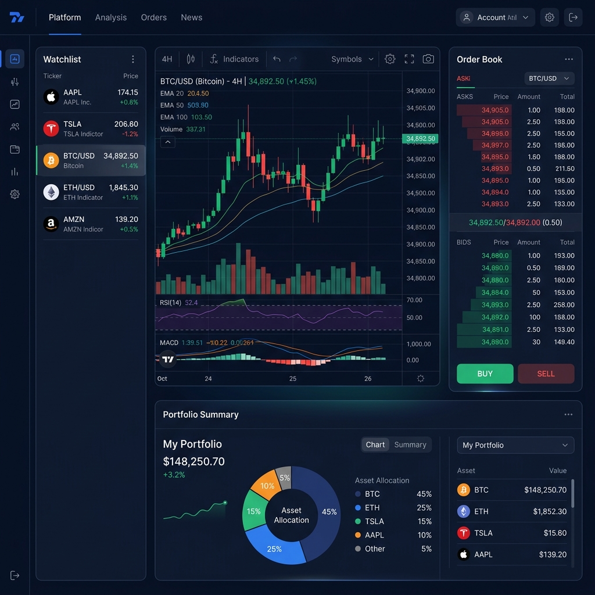
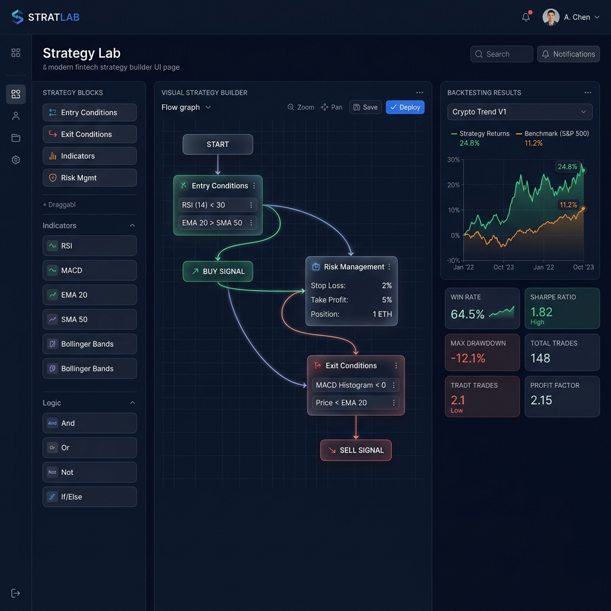
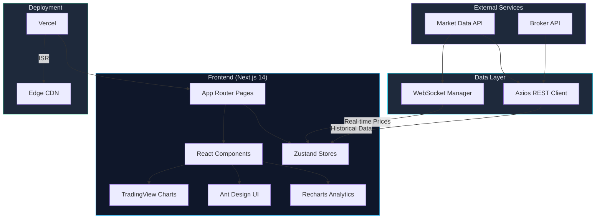
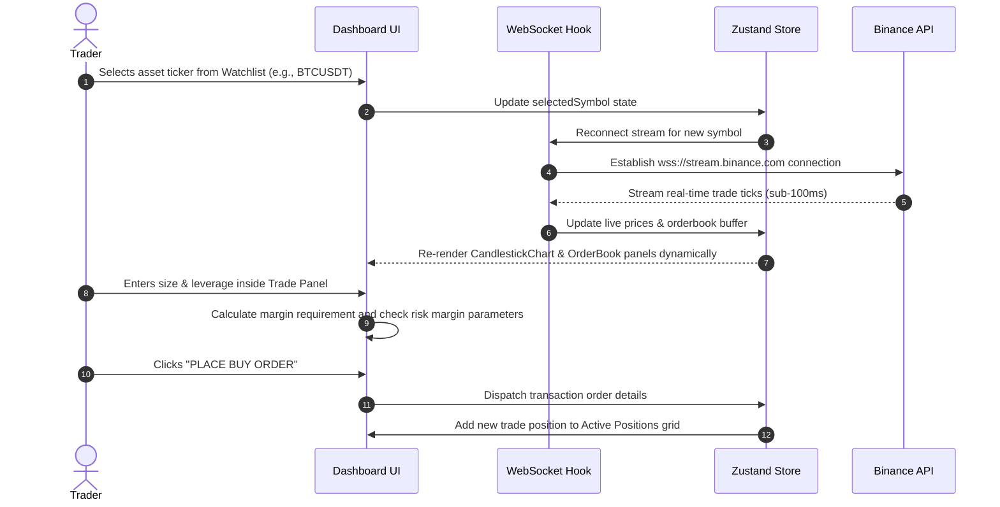

<p align="center">
  
  
  
  
  
  
  
</p>

<h1 align="center">📈 AlphaDesk</h1>

<p align="center">
  <strong>Real-Time Algorithmic Trading Dashboard & Strategy Builder</strong>
</p>

<p align="center">
  A production-grade fintech web application for live market data visualization, algorithmic strategy building, backtesting, and portfolio analytics — built with modern React ecosystem technologies.
</p>

<p align="center">
  <a href="#features">Features</a> •
  <a href="#tech-stack">Tech Stack</a> •
  <a href="#architecture">Architecture</a> •
  <a href="#screenshots">Screenshots</a> •
  <a href="#getting-started">Getting Started</a> •
  <a href="#roadmap">Roadmap</a>
</p>

---

## 🖥️ Screenshots

### Trading Dashboard
> Live candlestick charts, order book, depth-of-market visualizations, and real-time watchlist with WebSocket-driven price streaming.



### Strategy Builder
> Drag-and-drop visual strategy builder with technical indicators, backtesting engine, and performance analytics.



---

## ✨ Features

### 📊 Trading Dashboard
- **Live Candlestick Charts** — Powered by TradingView Lightweight Charts with multi-timeframe support (1m, 5m, 15m, 1H, 4H, 1D, 1W)
- **Interactive Order Book** — Real-time bid/ask depth visualization with horizontal bar representation
- **Depth-of-Market (DOM)** — Live market depth with cumulative volume display
- **Watchlist** — Customizable watchlist with real-time price updates, change %, and sparklines
- **WebSocket Streaming** — Sub-100ms latency data feeds for all market instruments

### 🧠 Strategy Builder
- **Drag-and-Drop Builder** — Visual flow editor for constructing trading strategies with connected logic blocks
- **Technical Indicators** — RSI, MACD, Bollinger Bands, Moving Averages, Volume Profile, and 20+ more
- **Entry/Exit Conditions** — Visual conditional logic for trade entry, exit, and stop-loss rules
- **Risk Management** — Position sizing, max drawdown limits, and portfolio risk controls

### 📈 Backtesting Engine
- **Historical Backtesting** — Test strategies against historical data with Recharts performance visualization
- **Performance Metrics** — Win rate, Sharpe ratio, max drawdown, profit factor, total return vs. benchmark
- **Multi-Timeframe Analysis** — Test across different timeframes simultaneously
- **Strategy Comparison** — Compare multiple strategies side-by-side

### 🏪 Strategy Marketplace
- **Browse Strategies** — Discover community-built trading strategies with performance ratings
- **Strategy Sharing** — Publish and share strategies with the community
- **Performance Leaderboard** — Ranked strategies by historical performance metrics

### 💼 Portfolio Analytics
- **Portfolio Overview** — Real-time portfolio value, P&L, and allocation breakdown
- **Asset Allocation** — Interactive pie/donut charts for portfolio diversification analysis
- **Trade History** — Complete trade log with filtering, sorting, and export capabilities

### 🎨 UI/UX
- **Responsive Design** — Pixel-perfect layouts across desktop, tablet, and mobile breakpoints
- **Dark/Light Theme** — System-aware theme with manual toggle
- **Lighthouse 95+** — Optimized for performance, accessibility, and SEO
- **Ant Design Components** — Professional data tables, modals, forms, and navigation

---

## 🛠️ Tech Stack

| Layer | Technology |
|-------|-----------|
| **Framework** | Next.js 14 (App Router, ISR, Server Components) |
| **UI Library** | React.js 18 |
| **Language** | TypeScript |
| **State Management** | Zustand |
| **Styling** | Tailwind CSS |
| **Component Library** | Ant Design (antd) |
| **Charts** | TradingView Lightweight Charts, Recharts |
| **Real-Time Data** | WebSocket (native + custom hooks) |
| **HTTP Client** | Axios (REST API integration) |
| **Deployment** | Vercel (ISR + Edge Functions) |
| **Linting** | ESLint + Prettier |
| **Package Manager** | pnpm |

---

## 🏗️ Architecture

```
AlphaDesk/
├── src/
│   ├── app/                    # Next.js App Router pages
│   │   ├── dashboard/          # Trading dashboard page
│   │   ├── strategy-builder/   # Drag-and-drop strategy builder
│   │   ├── marketplace/        # Strategy marketplace
│   │   ├── portfolio/          # Portfolio analytics
│   │   ├── backtest/           # Backtesting engine UI
│   │   └── layout.tsx          # Root layout with providers
│   │
│   ├── components/             # 40+ Reusable UI components
│   │   ├── charts/             # TradingView & Recharts wrappers
│   │   │   ├── CandlestickChart.tsx
│   │   │   ├── DepthChart.tsx
│   │   │   ├── PerformanceChart.tsx
│   │   │   └── VolumeChart.tsx
│   │   ├── trading/            # Trading-specific components
│   │   │   ├── OrderBook.tsx
│   │   │   ├── Watchlist.tsx
│   │   │   ├── TradePanel.tsx
│   │   │   └── PositionTable.tsx
│   │   ├── strategy/           # Strategy builder components
│   │   │   ├── FlowEditor.tsx
│   │   │   ├── IndicatorNode.tsx
│   │   │   ├── ConditionNode.tsx
│   │   │   └── BacktestResults.tsx
│   │   └── ui/                 # Base UI components (Ant Design)
│   │       ├── DataTable.tsx
│   │       ├── Modal.tsx
│   │       ├── ThemeToggle.tsx
│   │       └── Sidebar.tsx
│   │
│   ├── hooks/                  # Custom React hooks
│   │   ├── useWebSocket.ts     # WebSocket connection manager
│   │   ├── useMarketData.ts    # Real-time market data hook
│   │   ├── useBacktest.ts      # Backtesting engine hook
│   │   └── useTheme.ts         # Dark/Light theme hook
│   │
│   ├── stores/                 # Zustand state stores
│   │   ├── marketStore.ts      # Market data & watchlist state
│   │   ├── strategyStore.ts    # Strategy builder state
│   │   ├── portfolioStore.ts   # Portfolio & positions state
│   │   └── uiStore.ts          # UI preferences & layout state
│   │
│   ├── services/               # API & WebSocket services
│   │   ├── api.ts              # Axios instance & interceptors
│   │   ├── marketApi.ts        # Market data REST endpoints
│   │   ├── brokerApi.ts        # Broker integration APIs
│   │   └── wsManager.ts        # WebSocket connection manager
│   │
│   ├── types/                  # TypeScript type definitions
│   │   ├── market.ts
│   │   ├── strategy.ts
│   │   ├── portfolio.ts
│   │   └── api.ts
│   │
│   └── utils/                  # Utility functions
│       ├── formatters.ts       # Price, volume, date formatters
│       ├── indicators.ts       # Technical indicator calculations
│       └── validators.ts       # Input validation helpers
│
├── public/                     # Static assets
├── tailwind.config.ts          # Tailwind configuration
├── next.config.js              # Next.js configuration
├── tsconfig.json               # TypeScript configuration
└── package.json
```

### System Architecture



### 🔄 User Flow Diagram



---

## 🚀 Getting Started

### Prerequisites

- **Node.js** >= 18.0
- **pnpm** >= 8.0

### Installation

```bash
# Clone the repository
git clone https://github.com/rajmodi262/AlphaDesk.git
cd AlphaDesk

# Install dependencies
pnpm install

# Set up environment variables
cp .env.example .env.local

# Start development server
pnpm dev
```

### Environment Variables

```env
# Market Data
NEXT_PUBLIC_WS_URL=wss://stream.binance.com:9443/ws
NEXT_PUBLIC_API_BASE_URL=https://api.binance.com/api/v3

# App Config
NEXT_PUBLIC_APP_NAME=AlphaDesk
NEXT_PUBLIC_DEFAULT_THEME=dark
```

Open [http://localhost:3000](http://localhost:3000) to view the dashboard.

---

## 📦 Key Dependencies

```json
{
  "next": "^14.2.0",
  "react": "^18.3.0",
  "typescript": "^5.4.0",
  "zustand": "^4.5.0",
  "lightweight-charts": "^4.1.0",
  "recharts": "^2.12.0",
  "antd": "^5.16.0",
  "tailwindcss": "^3.4.0",
  "axios": "^1.6.0"
}
```

---

## 🗺️ Roadmap

- [x] Real-time candlestick charts with TradingView
- [x] WebSocket price streaming integration
- [x] Interactive order book & depth chart
- [x] Responsive dashboard layout
- [x] Dark/Light theme support
- [x] Zustand state management
- [x] Strategy builder drag-and-drop UI
- [x] Backtesting with Recharts visualization
- [x] Strategy marketplace UI
- [x] Portfolio analytics dashboard
- [x] Ant Design data tables & forms
- [ ] Paper trading simulation
- [ ] Multi-exchange support (Binance, Bybit, OKX)
- [ ] Mobile app (React Native)
- [ ] AI-powered strategy suggestions
- [ ] Social trading features

---

## 📄 License

This project is licensed under the MIT License — see the [LICENSE](LICENSE) file for details.

---

<p align="center">
  Built with ❤️ by <a href="https://github.com/rajmodi262">Raj Modi</a>
</p>
